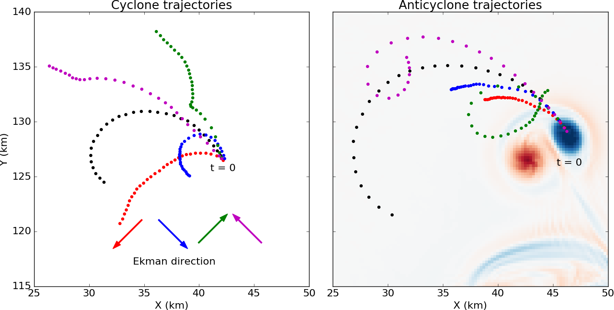

This repo contains the files used to generate the inputs for 'Generation of sub-surface anticyclones at Arctic surface fronts due to a surface stress' by Brannigan et al. (JPO, 2017).  

The animated version of Figure 8 in the paper can be seen on vimeo by clicking on the image below:

The directory generate_inputs has the python scripts used to generate the basic set-up.  To generate input files you need to run 'python create_experiments.py'.  The MITgcm binary input files will then appear in the directory.  A date-stamped copy of the scripts used to generate the input files will also be created - this line will result in an error until the proper path is added in create_experiments.py, however.

The files for the MITGcm model version used can be found in the directory mitgcm.  The optfile used is linux_archer_gfortran2 and is in the mitgcm/tools/build_options folder.

The files used for running particular experiments can be found in experiment_files.  This includes a directory of the compile-time files such as SIZE.h and a directory of the run-time files such as data.
